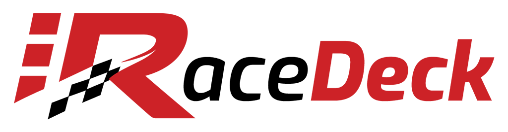

<p align="center">
  
</p>

<p align="center">
  Open-source <a href="https://www.elgato.com/stream-deck">Elgato Stream Deck</a> plugin for <a href="https://www.iracing.com/">iRacing</a>. Turn your Stream Deck into a fully-featured button box with live telemetry, pit controls, camera management, and more.
</p>

<p align="center">
  <a href="https://discord.gg/c6nRYywpah"></a>
</p>

## Features

**28 actions** across 8 categories, all with Stream Deck+ encoder support:

| Category | Actions | Examples |
|----------|---------|---------|
| **Display & Session** | Session Info | Incidents, lap count, position, fuel, flags |
| **Driving Controls** | Audio, Black Box, Look Direction, Car Control | Spotter volume, black box cycling, pit limiter, ignition |
| **Cockpit & Interface** | Cockpit Misc, Splits Delta, Telemetry, Toggle UI | Wipers, FFB, delta modes, HUD elements |
| **View & Camera** | View Adjustment, Replay (3), Camera (4) | FOV, replay transport, camera focus, broadcast tools |
| **Media** | Media Capture | Video recording, screenshots |
| **Pit Service** | Quick Actions, Fuel, Tires | Tearoff, fuel add/reduce, tire compound, fast repair |
| **Car Setup** | Brakes, Chassis, Aero, Engine, Fuel, Hybrid | Brake bias, ARB, wing, boost, ERS deploy modes |
| **Chat** | Chat | Open chat, macros, whisper, reply |

**Key highlights:**

- Live telemetry at 4 Hz with automatic iRacing connection/reconnection
- All keyboard shortcuts are user-configurable via the Property Inspector
- SDK-first design: uses iRacing broadcast commands where possible, keyboard simulation only as fallback
- Native C++ addon for low-latency Win32 API access

## Installation

### Users

1. Download the latest `.streamDeckPlugin` release
2. Double-click to install
3. Find **iRaceDeck** in the Stream Deck action list

### Developers

**Prerequisites:**

- Windows 10+ (iRacing is Windows-only)
- [Node.js](https://nodejs.org/) 24+
- [pnpm](https://pnpm.io/) 10+
- Python 3.x and [Visual Studio Build Tools](https://visualstudio.microsoft.com/visual-cpp-build-tools/) with the C++ workload (for the native addon)
- [Elgato Stream Deck](https://docs.elgato.com/sdk/) software

```bash
git clone https://github.com/your-org/iRaceDeck.git
cd iRaceDeck
pnpm install
pnpm build
```

#### Development workflow

```bash
# Build only the Stream Deck plugin packages
pnpm build:stream-deck

# Watch mode with hot-reload (restarts Stream Deck automatically)
pnpm watch:stream-deck

# Run tests
pnpm test

# Lint and format
pnpm lint:fix
pnpm format:fix
```

## Project Structure

A pnpm monorepo built with [Turborepo](https://turbo.build/):

```
packages/
  iracing-native/          C++ N-API addon (shared memory, window messaging, scan codes)
  iracing-sdk/             TypeScript SDK (telemetry, broadcast commands, session parsing)
  logger/                  Shared logger interface
  stream-deck-plugin/ The Stream Deck plugin (actions, icons, Property Inspector, shared utilities)
```

| Package | Role |
|---------|------|
| `@iracedeck/iracing-native` | C++ Node.js addon for Win32 APIs (memory-mapped files, window messaging, scan-code input) |
| `@iracedeck/iracing-sdk` | TypeScript SDK for reading telemetry and sending iRacing broadcast commands |
| `@iracedeck/logger` | Shared logging interface with scoped loggers |
| `@iracedeck/stream-deck-plugin` | The Stream Deck plugin: 28 actions with icons, Property Inspector UIs, and shared utilities (base classes, icon generation, keyboard service, PI components, global settings) |

### How it fits together

```
Stream Deck button press
  -> stream-deck-plugin (action handler + keyboard service / SDK commands)
    -> iracing-sdk (broadcast command) or iracing-native (scan-code keystroke)
      -> iRacing

iRacing telemetry (shared memory)
  -> iracing-native (reads memory-mapped file)
    -> iracing-sdk (parses telemetry buffer, 4 Hz update loop)
      -> stream-deck-plugin (updates button display)
```

## Contributing

Contributions are welcome! Here's how to get started:

1. Fork the repo and create a branch (`feature/123-your-feature`)
2. Follow [conventional commits](https://www.conventionalcommits.org/) with package scope (e.g. `feat(stream-deck-plugin): add new action`)
3. Add tests for new code (Vitest)
4. Make sure `pnpm build` and `pnpm test` pass
5. Open a pull request

### Adding a new action

Actions live in `packages/stream-deck-plugin/src/actions/`. Each action needs:

1. An action class extending `ConnectionStateAwareAction`
2. Registration in `plugin.ts`
3. An entry in `manifest.json`
4. Category icon (20x20 SVG) and key icon (72x72 SVG)
5. A Property Inspector template (EJS -> HTML)
6. Unit tests

See the existing actions for reference, or check the package-level docs in `packages/stream-deck-plugin/`.

## Troubleshooting

| Problem | Solution |
|---------|----------|
| Plugin doesn't connect | Make sure iRacing is running and you're in a session (on track) |
| Buttons show nothing | iRacing telemetry is only available while driving; the plugin reconnects automatically |
| Native addon build fails | Install Python 3.x and VS Build Tools with C++ workload. Try `npm config set msvs_version 2022` |
| Key presses don't work | Check your key bindings in the Property Inspector match your iRacing configuration |

## License

[MIT](LICENSE)

## Acknowledgements

- [Elgato Stream Deck SDK](https://github.com/elgatosf/streamdeck)
- [iRacing SDK](https://forums.iracing.com/discussion/15068/official-iracing-sdk)
- [Node-API (N-API)](https://nodejs.org/api/n-api.html)
- [pyirsdk](https://github.com/kutu/pyirsdk) (reference implementation)
