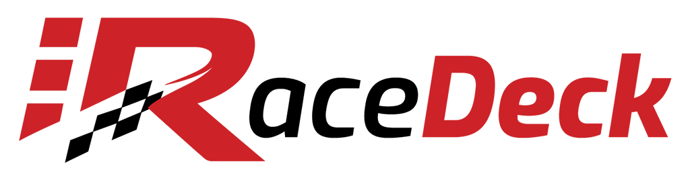

<p align="center">
  
</p>

<p align="center">
  iRaceDeck is an <a href="https://www.elgato.com/stream-deck">Elgato Stream Deck</a>, <a href="https://miraboxbuy.com/">Mirabox</a>, and <a href="https://www.ulanzi.com/">Ulanzi Deck</a> plugin for <a href="https://www.iracing.com/">iRacing</a>. Turn your Stream Deck, Mirabox, or Ulanzi Deck into a fully-featured button box with live telemetry, pit controls, camera management, and more.
</p>

<p align="center">
  <a href="https://coderabbit.ai"></a>
  <a href="https://discord.gg/c6nRYywpah"></a>
</p>

## Table of contents

- [Features](#features)
- [Installation](#installation)
- [Project Structure](#project-structure)
- [Releasing](#releasing)
- [Contributing](#contributing)
- [Troubleshooting](#troubleshooting)
- [Usage and license](#usage-and-license)
- [For companies](#for-companies)
- [Inspiration](#inspiration)
- [Acknowledgements](#acknowledgements)

## Features

**32 actions** with **265+ modes** across 9 categories:

| Category                | Actions | Modes | Examples                                                              |
| ----------------------- | ------- | ----- | --------------------------------------------------------------------- |
| **Display & Session**   | 2       | 8     | Incidents, laps, position, fuel, laps to empty, flags                 |
| **Driving Controls**    | 6       | 32    | AI spotter, audio (incl. Race Engineer & Radar volume), black box cycling, look direction, car control, pit crew |
| **Cockpit & Interface** | 5       | 34    | Wipers, FFB, splits & reference, telemetry, UI toggles                |
| **View & Camera**       | 5       | 90    | FOV, replay, camera controls, broadcast tools                         |
| **Media**               | 1       | 7     | Video recording, screenshots                                          |
| **Pit Service**         | 3       | 15    | Fuel (button and dial), tires, compounds, tearoff, fast repair        |
| **Car Setup**           | 7       | 44    | Brakes (button and dial), chassis, aero, engine, fuel mix, hybrid/ERS, traction control |
| **Communication**       | 2       | 34    | Chat, macros, whisper, reply, race admin commands                     |
| **Stream Deck**         | 1       | 1     | Switch to bundled iRaceDeck profiles (Elgato only)                    |

**Key highlights:**

- Live telemetry at 4 Hz with automatic iRacing connection/reconnection
- **Pit Crew** action with **Radar** directional proximity ticks via multi-channel audio mixer (miniaudio); a voice **Race Engineer** feature is planned for a follow-up release
- All keyboard shortcuts are user-configurable via the Property Inspector
- SDK-first design: uses iRacing broadcast commands where possible, keyboard simulation only as fallback
- Native C++ addon for low-latency Win32 API access (iRacing SDK, keyboard input, audio engine)

## Installation

### Users

1. Download the latest `.streamDeckPlugin` release
2. Double-click to install
3. Find **iRaceDeck** in the Stream Deck action list

### Developers

**Prerequisites:**

- Windows 10+ (iRacing is Windows-only)
- [Node.js](https://nodejs.org/) 24+
- [pnpm](https://pnpm.io/) 10+
- Python 3.x and [Visual Studio Build Tools](https://visualstudio.microsoft.com/visual-cpp-build-tools/) with the C++ workload (for the native addon)
- [Elgato Stream Deck](https://docs.elgato.com/sdk/) software

```bash
git clone https://github.com/niklam/iracedeck.git
cd iracedeck
pnpm install
pnpm build
```

#### Development workflow

```bash
# Build only the Stream Deck plugin packages
pnpm build:stream-deck

# Watch mode with hot-reload (restarts Stream Deck automatically)
pnpm watch:stream-deck

# Run tests
pnpm test

# Lint and format
pnpm lint:fix
pnpm format:fix
```

## Project Structure

A pnpm monorepo built with [Turborepo](https://turbo.build/):

```text
packages/
  iracing-actions/         Platform-agnostic iRacing action implementations
  deck-adapter-elgato/     Elgato Stream Deck adapter (bridges Elgato SDK to deck-core)
  deck-adapter-mirabox/    Mirabox VSD Craft adapter (WebSocket protocol to deck-core)
  deck-adapter-ulanzi/     Ulanzi Deck adapter (UlanziStudio WebSocket protocol to deck-core)
  deck-core/               Platform-agnostic base classes, types, and shared utilities
  icon-composer/           Standalone SVG icon assembly (zero dependencies)
  icons/                   SVG icon templates (Mustache)
  iracing-native/          C++ N-API addon (shared memory, window messaging, scan codes)
  iracing-sdk/             TypeScript SDK (telemetry, broadcast commands, session parsing)
  logger/                  Shared logger interface
  iracing-plugin-mirabox/          Mirabox device plugin
  iracing-plugin-ulanzi/           Ulanzi Deck device plugin
  pi-components/           Shared Property Inspector assets (web components, EJS templates, partials, data)
  iracing-plugin-stream-deck/      Elgato Stream Deck plugin
  website/                 Documentation website (iracedeck.com)
```

| Package                           | Role                                                                                      |
| --------------------------------- | ----------------------------------------------------------------------------------------- |
| `@iracedeck/iracing-actions`              | All 31 action implementations, platform-agnostic                                          |
| `@iracedeck/deck-core`            | Base classes, types, keyboard service, icon templates, global settings                    |
| `@iracedeck/deck-adapter-elgato`  | Bridges the Elgato SDK to deck-core's `IDeckPlatformAdapter` interface                    |
| `@iracedeck/deck-adapter-mirabox` | Bridges the Mirabox VSD Craft WebSocket protocol to deck-core                             |
| `@iracedeck/deck-adapter-ulanzi`  | Bridges the UlanziStudio WebSocket protocol to deck-core                                  |
| `@iracedeck/icon-composer`        | Standalone SVG icon assembly (pure functions, zero dependencies)                          |
| `@iracedeck/icons`                | SVG icon Mustache templates with colorization support                                     |
| `@iracedeck/iracing-native`       | C++ Node.js addon for Win32 APIs (memory-mapped files, window messaging, scan-code input) |
| `@iracedeck/iracing-sdk`          | TypeScript SDK for reading telemetry and sending iRacing broadcast commands               |
| `@iracedeck/logger`               | Shared logging interface with scoped loggers                                              |
| `@iracedeck/pi-components`        | Shared PI web components, EJS templates + partials, template data, and Rollup EJS plugin  |
| `@iracedeck/iracing-plugin-stream-deck`   | Elgato Stream Deck plugin — registers actions, PI templates, manifest                     |
| `@iracedeck/iracing-plugin-mirabox`       | Mirabox plugin — registers the same actions for Mirabox devices                           |
| `@iracedeck/iracing-plugin-ulanzi`        | Ulanzi Deck plugin — registers the same actions for Ulanzi devices                         |
| `@iracedeck/website`              | Documentation website at [iracedeck.com](https://iracedeck.com)                           |

### How it fits together

```text
Button press (Stream Deck, Mirabox, or Ulanzi Deck)
  -> adapter (deck-adapter-elgato / deck-adapter-mirabox / deck-adapter-ulanzi)
    -> actions (platform-agnostic action handler)
      -> deck-core (keyboard service / SDK commands)
        -> iracing-sdk (broadcast command) or iracing-native (scan-code keystroke)
          -> iRacing

iRacing telemetry (shared memory)
  -> iracing-native (reads memory-mapped file)
    -> iracing-sdk (parses telemetry buffer, 4 Hz update loop)
      -> deck-core (notifies subscribers)
        -> actions (updates button display via adapter)
```

## Releasing

All packages share a single version number. Releases are automated using [release-it](https://github.com/release-it/release-it) with the conventional-changelog plugin.

### How to release

```bash
pnpm release            # auto-detect version bump from commits
pnpm release -- 2.0.0   # force a specific version
pnpm release:dry        # preview without making changes
```

The release script will:

1. Analyze conventional commits since the last tag to determine the version bump (`fix` = patch, `feat` = minor, `BREAKING CHANGE` = major)
2. Update `CHANGELOG.md` with grouped entries (Features, Bug Fixes, etc.)
3. Bump the version in the root `package.json`, all `packages/*/package.json` files, and the Stream Deck `manifest.json`
4. Create a commit (`chore(release): vX.Y.Z`), git tag (`vX.Y.Z`), and push to origin
5. Create a GitHub Release with the changelog as release notes

### Plugin packaging (CI)

`.github/workflows/release-pack.yml` is a reusable workflow invoked by `release.yml` (which runs automatically when a version tag is pushed). It:

1. Builds the full monorepo once on Windows
2. Packs all three plugins (Stream Deck, Mirabox, Ulanzi) from that single build using `streamdeck pack`
3. Attaches each packed plugin to the GitHub Release

### Requirements

- [GitHub CLI](https://cli.github.com/) (`gh`) must be authenticated — the release script reads your token via `gh auth token`

## Contributing

Contributions are welcome! Here's how to get started:

1. Fork the repo and create a branch (`feature/123-your-feature`)
2. Follow [conventional commits](https://www.conventionalcommits.org/) with package scope (e.g. `feat(iracing-plugin-stream-deck): add new action`)
3. Add tests for new code (Vitest)
4. Make sure `pnpm build` and `pnpm test` pass
5. Open a pull request

### Adding a new action

Actions live in `packages/iracing-actions/src/actions/<action-name>/`, one folder per action. Each action needs:

1. `<action-name>.ts` — action class extending `ConnectionStateAwareAction` from `@iracedeck/deck-core`
2. `<action-name>.test.ts` — unit tests
3. `<action-name>.ejs` — Property Inspector template (compiled to `ui/<action-name>.html`)
4. `icon.svg` + `key.svg` — static category and key icons (copied into each plugin's `imgs/actions/<name>/` at build time)
5. Mustache SVGs in `packages/icons/<action-name>/` for any dynamic variants
6. Registration in both `packages/iracing-plugin-stream-deck/src/plugin.ts` and `packages/iracing-plugin-mirabox/src/plugin.ts`
7. Manifest entry in each plugin's `manifest.json`
8. Entries in `packages/iracing-actions/src/actions/data/{key-bindings,docs-urls,icon-defaults}.json` where applicable

See the existing actions for reference, or check `packages/iracing-plugin-stream-deck/CLAUDE.md` for step-by-step instructions.

## Troubleshooting

| Problem                                             | Solution                                                                                                                         |
| --------------------------------------------------- | -------------------------------------------------------------------------------------------------------------------------------- |
| Double-clicking `.streamDeckPlugin` doesn't install | Rename the file to add `.zip` at the end, extract the contents to `%APPDATA%\Elgato\StreamDeck\Plugins`, and restart Stream Deck |
| Plugin doesn't connect                              | Make sure iRacing is running and you're in a session (on track)                                                                  |
| Buttons show nothing                                | iRacing telemetry is only available while driving; the plugin reconnects automatically                                           |
| Native addon build fails                            | Install Python 3.x and VS Build Tools with C++ workload. Try `npm config set msvs_version 2022`                                  |
| Key presses don't work                              | Check your key bindings in the Property Inspector match your iRacing configuration                                               |

## Usage and license

iRaceDeck is source-available and licensed under the [iRaceDeck Non-Commercial License v1.1](LICENSE).

Free for personal and non-commercial use, including use in sim racing events and competitions.

Plugin downloads ship the license alongside [THIRD-PARTY-LICENSES.md](THIRD-PARTY-LICENSES.md), which aggregates the license notices of every bundled third-party component.

For full details, see [USAGE.md](USAGE.md).

The name “iRaceDeck” and associated branding are not included in the license and may not be used for derived versions without permission.

If you're unsure whether your use case is allowed, feel free to reach out.

### Why this license?

iRaceDeck is source-available rather than open source.

The goal is simple:
- Keep iRaceDeck free for sim racers, hobbyists, and the community
- Allow people to build on top of it (profiles, icons, tools, integrations)
- Prevent others from selling or commercializing the plugin itself without permission
- Require that anyone who distributes a modified version of iRaceDeck makes their modifications publicly available, so the community keeps benefiting from improvements

If you're just using, modifying, or contributing to iRaceDeck, nothing changes for you.

If you're building something commercial around iRaceDeck, that's usually fine — just don't redistribute or sell the plugin itself. If you're unsure, feel free to reach out.

## For companies

If you're working on something commercial based on iRaceDeck, feel free to reach out.

I'm open to licensing, collaboration, or helping you build on top of it.

Contact: [niklas@iracedeck.com](niklas@iracedeck.com)

## Inspiration

This project was inspired by [iRaceIT](https://iraceit.itxware.de/), a Stream Deck plugin for iRacing.

## Acknowledgements

- [Elgato Stream Deck SDK](https://github.com/elgatosf/streamdeck)
- [iRacing SDK](https://forums.iracing.com/discussion/15068/official-iracing-sdk)
- [Node-API (N-API)](https://nodejs.org/api/n-api.html)
- [pyirsdk](https://github.com/kutu/pyirsdk) (reference implementation)
