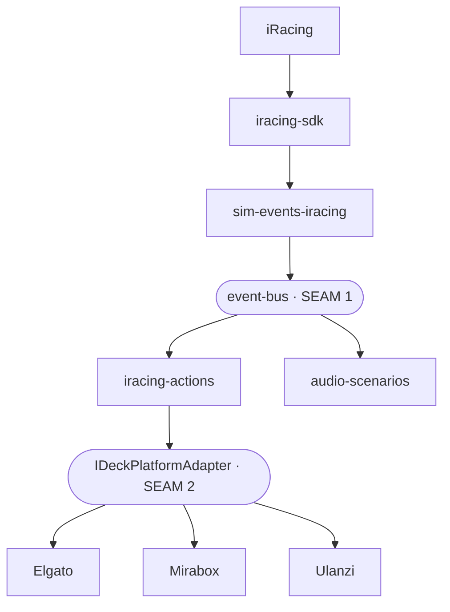

# iRaceDeck Architecture Diagrams — Design

_Spec date: 2026-06-27_

## Goal

Add a visual **Architecture** page to the website's Development docs that explains how iRaceDeck flows from iRacing through to the Stream Deck / Mirabox / Ulanzi plugins. It must serve two audiences at once: contributors learning the codebase, and the maintainer reasoning about the system's abstraction seams. Diagrams are authored as **Mermaid** in the repo so the same source renders on the site and stays in sync with the code (the project's hard "keep docs in sync with reality" rule rules out static images).

## Verified architecture (the facts the diagrams encode)

Confirmed against source, not docs:

**Inbound — telemetry → semantic events**

- Init order, `packages/iracing-plugin-stream-deck/src/plugin.ts`: `initializeSDK(...)` (L209) → `initializeEventBus(...)` (L214) → `initializeSimEventsIracing(eventBus, getController(), ...)` (L218).
- Translator, `packages/sim-events-iracing/src/translator.ts`: subscribes to SDK controller ticks at `sdkController.subscribe(...)` (L156); diffs the snapshot and publishes semantic events at `self.bus.publish(envelope)` (L1217). This is the **only** package coupled to iRacing telemetry.
- `packages/event-bus/src/event-catalog.ts`: the `SimEvent<T>` envelope carries a **generic** `telemetry: T` field — no `@iracedeck/iracing-sdk` import. Sim-agnostic by construction; future translators (`sim-events-ac`, …) are siblings emitting the same catalog.

**Outbound — reaction → device, and button → iRacing**

- `IDeckPlatformAdapter` interface: `packages/deck-core/src/types.ts:79`.
- Three implementations: `ElgatoPlatformAdapter` (`deck-adapter-elgato/src/adapter.ts:142`), `VSDPlatformAdapter` (`deck-adapter-mirabox/src/adapter.ts:120`), `UlanziPlatformAdapter` (`deck-adapter-ulanzi/src/adapter.ts:122`).
- One shared action set in `@iracedeck/iracing-actions`, registered into all three plugins via `adapter.registerAction(UUID, handler)` (e.g. `iracing-plugin-stream-deck/src/plugin.ts:765`, `iracing-plugin-mirabox/src/plugin.ts:735`, `iracing-plugin-ulanzi/src/plugin.ts:740`).
- Command path defined in deck-core: `getCommands()` (`deck-core/src/sdk-singleton.ts:78`, SDK broadcast), `getKeyboard()` (`deck-core/src/keyboard-service.ts:468`, native injection), plus chat commands via `getCommands().chat.*`.

**Race Engineer branch**

- `packages/audio-scenarios/src/catalog/pit-crew/index.ts`: `registerRadarEngine(bus, ...)` (L857) and `registerSpotterEngine(bus, ...)` (L859) receive the event bus; scenarios subscribe through the scenario engine DSL (`when: { event }`) and route to `audio-service` → `audio-native`.

**The shape:** an hourglass / bowtie. Many sims funnel **in** through `event-bus` (seam 1), through one shared brain, then fan **out** through `IDeckPlatformAdapter` (seam 2) to many devices.

## Website integration (verified)

- Stack: Astro 6.4.2 + Starlight 0.39.2. Docs collection at `packages/website/src/content/docs/` (`.md` / `.mdx`), configured in `src/content.config.ts` (`docsLoader()` / `docsSchema()`).
- Existing Development section: `src/content/docs/docs/development/` (`index.md`, `tech-stack.md`, `contributing.md`, `setup.md`, `feature-flags.md`). Sidebar group in `astro.config.mjs` (~L83–235).
- Mermaid is **not** wired in yet.

## Deliverable

### New page

`src/content/docs/docs/development/architecture.md` → `/docs/development/architecture/`. Add `{ slug: "docs/development/architecture" }` to the Development sidebar group in `astro.config.mjs`, immediately after `tech-stack`. Add a one-line cross-link from `tech-stack.md` to the new page. Division of labor: `tech-stack.md` = "what each package is"; `architecture.md` = "how they fit and flow."

### Diagrams (Mermaid, one page, one section + heading each)

1. **Hourglass overview** — ~8 grouped nodes; the anchor picture. Sim sources → `event-bus` (seam 1) → {`iracing-actions`, `audio-scenarios`} → `IDeckPlatformAdapter` (seam 2) → {Elgato, Mirabox, Ulanzi}.
2. **Inbound flow** — iRacing → `iracing-sdk` → sdkController ticks → `sim-events-iracing` (diff → translate) → `event-bus.publish` → subscribers.
3. **Outbound flow** — two paths on one diagram: *render* (event/state → action → `assembleIcon` → `deck-core` → adapter → device pixels) and *command* (button press → `getCommands()` / `getKeyboard()` / chat → back to iRacing).
4. **Package dependency map** — static monorepo import graph, grouped by subsystem, labeled **imports, not runtime flow**.
5. **Race Engineer branch** — `event-bus` → scenario engine → `audio-service` buses → `audio-native` mixer.

Node/edge content per diagram is specified precisely enough at implementation time; the overview shape is:

### Readability conventions

- **One arrow meaning per diagram.** Flow diagrams: solid = runtime data/control. Dependency diagram: arrows = imports. Each diagram carries a short legend.
- **Consistent subsystem colors** across all diagrams (sim / core+UI / audio / adapters / plugins) via Mermaid `classDef`.
- **Both seams styled identically in every diagram** (distinct shape + accent) so the reader anchors on them.

### Prose section — "Seams & where the abstraction leaks"

Short narrative naming each seam and what swapping it buys (new sim = new translator; new device = new adapter), then an honest list of current leaks/asymmetries:

- Inbound is abstracted (`event-bus`), outbound is not — the command path (`getCommands()`) is still iRacing-SDK-shaped.
- Device capability differences (SVG QT5 vs QT6.7+) leak around the adapter, handled at build time via `platform-feature-flags`, not through `IDeckPlatformAdapter`.
- Ulanzi reuses Elgato's plugin/action UUIDs verbatim — pragmatic coupling.
- `openUrl` is deliberately a concrete per-adapter method, off `IDeckPlatformAdapter` — a known, intentional interface gap.
- Audio and input are Windows-native (`audio-native`, `iracing-native`), mocked on other platforms.

### Build change

Wire client-side Mermaid rendering into Starlight. **Implementation-time verification:** confirm the right integration and its compatibility with Astro 6.4.2 / Starlight 0.39.2 (evaluate `astro-mermaid` vs a `rehype-mermaid` build-time approach) before pinning. Add the dependency with an exact version (repo `save-exact` rule), update `astro.config.mjs`, and commit `pnpm-lock.yaml`.

## Files touched

- `packages/website/src/content/docs/docs/development/architecture.md` (new)
- `packages/website/astro.config.mjs` (sidebar entry + Mermaid integration)
- `packages/website/src/content/docs/docs/development/tech-stack.md` (cross-link)
- `packages/website/package.json` + `pnpm-lock.yaml` (Mermaid dependency)

## Verification

- `pnpm --filter @iracedeck/website build` passes and the page renders all Mermaid fences at `/docs/development/architecture/`.
- Visual check: every diagram renders, legends present, seams visually distinct, no auto-layout overlap that obscures meaning.

## Out of scope

- No changes to runtime packages — documentation only (plus the website build wiring).
- No per-action documentation changes; this is system-level architecture only.
- Hand-drawn "hero" art (the hybrid option) is not pursued unless requested later.

## Open / deferred decisions

- Exact Mermaid integration + version — resolved during implementation against live compatibility.
- Whether to later split the page into multiple pages if it grows — single page for now.
