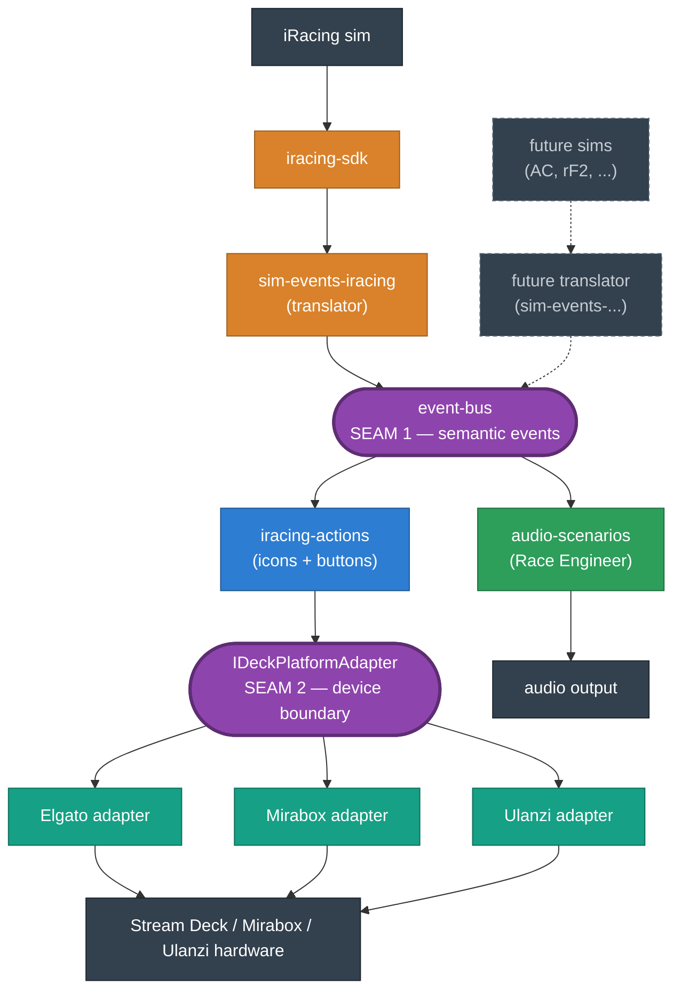
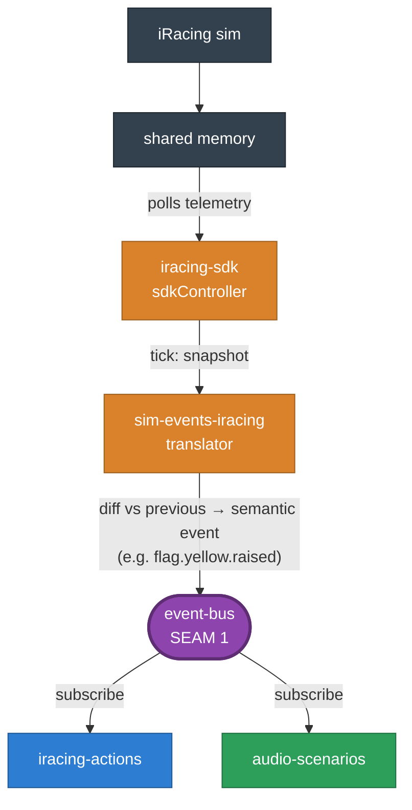
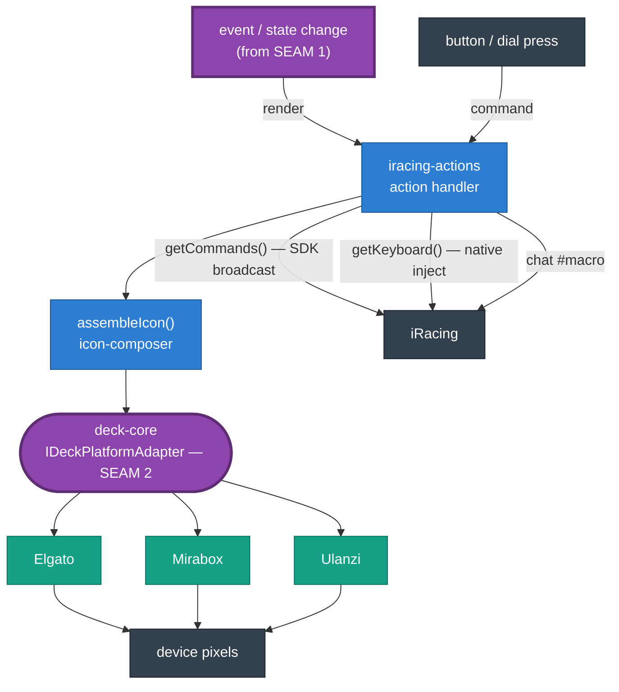
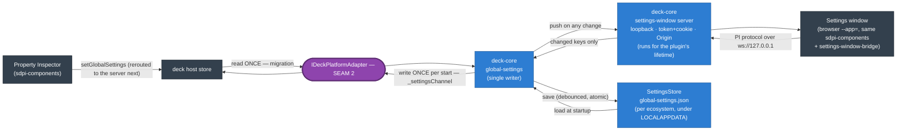
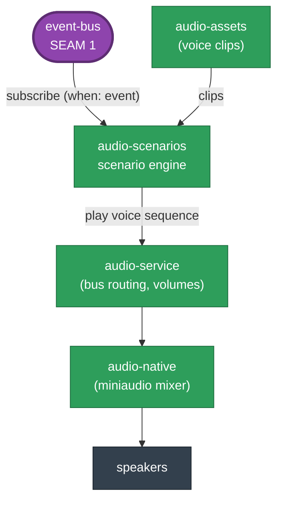
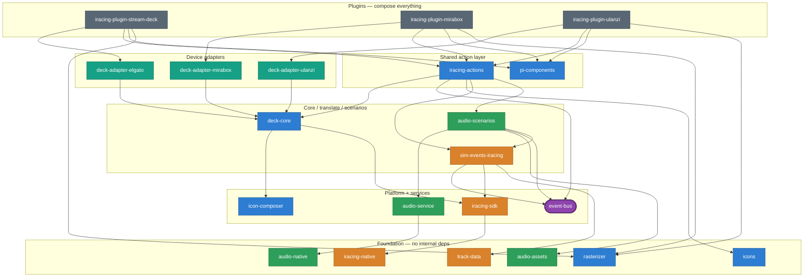

iRaceDeck is shaped like an **hourglass**. Many possible sims funnel *in* through one narrow seam, pass through a single shared "brain," then fan *out* through a second narrow seam to many devices. Those two seams — the **event bus** (inbound) and the **`IDeckPlatformAdapter`** (outbound) — are the whole architecture in a sentence: add a sim by writing one new translator, add a device by writing one new adapter, and nothing else changes.

This page is the visual companion to the [Tech Stack](/docs/development/tech-stack/) page (which lists what each package *is*). Here we show how they *fit and flow*.

## The big picture



Arrows show **runtime flow**. The two purple stadium nodes are the abstraction seams; they're styled the same way in every diagram below so you can anchor on them. The dashed node is hypothetical — it shows where a second sim would plug in.

Two things to notice. First, only `iracing-actions` flows down to the device seam — the **Race Engineer** (`audio-scenarios`) is a sibling consumer whose output goes to your speakers, never through the deck. Second, everything left of SEAM 1 is sim-specific; everything right of it is sim-agnostic — in principle (the action layer doesn't fully hold to this; see the *Seams & where the abstraction leaks* section below).

## Inbound: telemetry → semantic events

The only package coupled to iRacing telemetry is the **translator**, `sim-events-iracing`. It subscribes to the SDK controller's ticks, diffs each snapshot against the previous one, and publishes **semantic events** onto the bus — events named for what they *mean* in racing terms (`flag.yellow.raised`, `lap.completed`) rather than for the raw telemetry they were derived from, each fired once on the meaningful change. The bus envelope carries telemetry as a generic field — it imports no SDK — which is what makes it reusable for a future `sim-events-<sim>`.



This is why a button "knows" a yellow is out: it never reads telemetry itself — it subscribes to an event the translator derived.

## What the event bus provides

`event-bus` is the contract every consumer codes against. It gives them three things:

- **A typed, sim-agnostic event catalog** — the vocabulary of things that can happen (`flag.yellow.raised`, an overtake, a laps-of-fuel-left crossing, a pit-lane transition). It's a plain pub/sub package that imports no simulator SDK, so the vocabulary stays the same no matter which sim feeds it.
- **Decoupled fan-out** — publishers and subscribers never reference each other. The translator publishes; the actions and the Race Engineer each subscribe independently. You can add a consumer without touching the producer, and — in principle — swap the producer without touching the consumers.
- **A generic telemetry snapshot on the envelope** — alongside the semantic payload, each event carries the latest raw telemetry in a generic field. This is the sim-specific escape hatch: the Race Engineer's radar and spotter engines read it (via `getLatestTelemetry`) because their job needs the full per-car picture, not a single event. It is also the part of this seam that is **not** sim-agnostic yet — see the leaks below.

The catalog spans around 60 events grouped into families — pit lane and stops, flags, start lights, rolling start, pit service, tires, car control, pit limiter, incidents and off-tracks, overtakes and position changes, laps, fuel, proximity radar, track wetness, damage, and session lifecycle. Payloads range from empty (pure transitions like `pitLane.entered`) to rich records:

```text
flag.yellow.raised          → { scope: "local" | "full" }
fuel.lapsLeft.crossed       → { count: number, lapsLeft: number }
overtake.completed          → { position, previousPosition, gapBehindMeters?, isLeader, … }
```

The canonical, always-current list — every event name and its exact payload — is the `SimEventMap` type in [`event-bus/src/event-catalog.ts`](https://github.com/niklam/iracedeck/blob/master/packages/event-bus/src/event-catalog.ts). This page deliberately doesn't reproduce it: the types are the source of truth, and they change too often to mirror by hand.

## Outbound: reactions to devices, commands to iRacing

There are two outbound paths, and they're easy to conflate. The **render path** turns an event or state change into pixels on a key. The **command path** turns a button press into an action inside iRacing. Both run through `iracing-actions`, but they exit through different doors.



The render path is fully abstracted: `iracing-actions` hands a finished icon — an SVG data URI — to `deck-core`, and whichever adapter is loaded paints it on the real hardware. The icon crosses SEAM 2 unchanged, still as SVG; inside each adapter's context implementation (`setImage`, Elgato's `setFeedback`), `deck-core`'s rasterizer service converts it to PNG in-plugin (`@iracedeck/rasterizer`, wrapping `@resvg/resvg-js`, via the render function the plugin injected at startup) and sends the device pixels rather than an SVG string, so every key and dial looks identical regardless of which host's own SVG engine it's running on. The command path has three mechanisms — the SDK broadcast (`getCommands()`) is preferred, native keyboard injection (`getKeyboard()`) covers what the SDK can't, and chat macros cover the rest.

### The settings path (the settings window)

Since #992 there is a third outbound path that has nothing to do with iRacing: the plugin **serves a web page** and the user's browser is a client of the plugin. And since #993 the plugin also **owns the settings themselves**: plugin-global settings live in one JSON file per ecosystem (`SettingsStore` → `%LOCALAPPDATA%\iRaceDeck\Settings\<Stream Deck | Mirabox | Ulanzi>\global-settings.json`), loaded at startup and saved — debounced and atomically — on every change. The deck host's own store is now touched at most twice: it is **read once** — only when there is no file yet, to migrate an existing installation's settings across on the first start after the upgrade — and **written once per start** with `_settingsChannel` (the loopback server's port and token), the bootstrap every Property Inspector will use to find the plugin.



The window is the PI framework re-hosted: the same `sdpi-components.js`, `pi-components.js`, and `global-*.ejs` partials, talking to a **fake host** inside the plugin that speaks the global-settings subset of the Elgato PI protocol. Anything the plugin does on the window's behalf — persist its bounds, switch a deck's profile, play an audio preview, reveal the settings file in Explorer, answer SimHub reachability (a direct fetch from the window's origin is cross-origin) — arrives as a `sendToPlugin` command and is validated in `deck-core`. The page is opened as a chromeless app window in a Chromium browser with a dedicated profile, and closes itself when its socket to the plugin dies. The server is no longer started on demand: it comes up with the plugin and stays up, so its address is known before any UI asks for it.

Property Inspectors are the one client not yet rerouted: their `sdpi-components` still saves to the deck host's copy, which the plugin no longer reads. The next phase gives every PI the same loopback socket the window uses, bootstrapped from `_settingsChannel`; until then the settings window is the editing surface that reaches the plugin. Details, security model, and rules: `.claude/rules/settings-window.md` and `.claude/rules/global-settings.md`.

## The Race Engineer branch

The Race Engineer is a self-contained subsystem hanging off SEAM 1. It subscribes to the same bus, but instead of drawing icons it picks voice lines and plays them through a native mixer.



## Package dependency map

The diagrams above show **runtime flow**. This one shows something different: **build-time imports** — which package depends on which. Read the arrows as "imports." They point *downward*, toward the foundation.



To keep this readable, `@iracedeck/logger` (imported by nearly every package) and a few cross-cutting edges are omitted — the three plugins also pull in the audio stack, `event-bus`, and `sim-events-iracing` directly. The shape that matters: `deck-core` is the hub the device adapters share, and the foundation packages at the bottom depend on nothing internal. `rasterizer` is a foundation package too (it wraps `@resvg/resvg-js` and has no internal iRaceDeck dependencies), but note the arrow direction: each **plugin** imports it and injects a render function into `deck-core`'s rasterizer service at startup (`initializeRasterizer(...)`, gated by the `pngRasterization` feature flag) — `deck-core` itself never imports `rasterizer`, so there's deliberately no `deck-core → rasterizer` edge here.

## Seams & where the abstraction leaks

The system has exactly two intended seams, and naming what each one buys you is the fastest way to understand the codebase:

- **SEAM 1 — `event-bus`.** Everything upstream is sim-specific; everything that subscribes is meant to be sim-agnostic. Adding a new sim is, in principle, "write a new translator that publishes the same event catalog."
- **SEAM 2 — `IDeckPlatformAdapter`.** One shared action set is defined once and runs on every device. Adding a new device is "write a new adapter that implements the interface" — which is exactly how Mirabox and Ulanzi were added after Elgato.

Honest architecture documents its leaks, too. These are the places where the clean story above doesn't fully hold today:

- **Inbound is abstracted; outbound is not.** Telemetry is funneled through the sim-agnostic bus, but the command path is still iRacing-shaped: `getCommands()` returns iRacing SDK commands, and `deck-core` imports `iracing-sdk` directly. A second sim would need its own command vocabulary, which has no seam yet.
- **The shared layer isn't purely sim-agnostic.** `iracing-actions` imports `iracing-sdk` and `sim-events-iracing` directly — not only `deck-core` + `event-bus`. So "everything right of SEAM 1 is sim-agnostic" is an aspiration the action layer doesn't fully meet.
- **Device differences leak around the adapter.** The Stream Deck+ touch strip only exists on Elgato hardware, so touch-strip feedback and touch-tap input are handled at *build time* via a platform [feature flag](/docs/development/feature-flags/) (`dialFeedback`), not expressed through `IDeckPlatformAdapter` — a real device difference living outside the device seam. (A previous device difference here — divergent SVG rendering capability between hosts' own engines — was eliminated rather than papered over: since issue #642, icons still cross SEAM 2 as SVG, but each adapter's context implementation converts them to PNG in-plugin via `deck-core`'s rasterizer service before the host send, so no host-specific SVG engine is in the picture anymore.)
- **Ulanzi reuses Elgato's plugin and action UUIDs verbatim.** A pragmatic coupling: UlanziStudio doesn't validate the UUID prefix, so reusing the canonical IDs avoided a parallel identity scheme.
- **`openUrl` sits off the interface on purpose.** It's a concrete method on each adapter rather than part of `IDeckPlatformAdapter`, a deliberate gap that avoids touching every typed mock adapter for a rarely-used capability.
- **Some pieces are Windows-native.** `iracing-native` (keyboard/window) and `audio-native` (mixer) are C++ addons that fall back to mocks on other platforms — see [cross-platform development](/docs/development/setup/).
