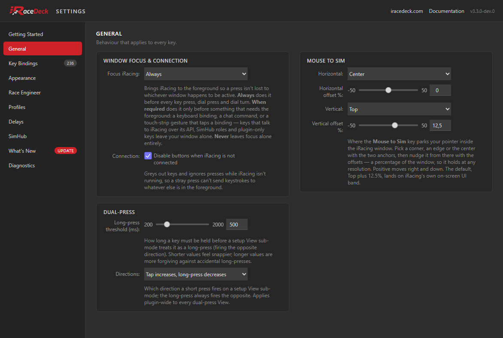
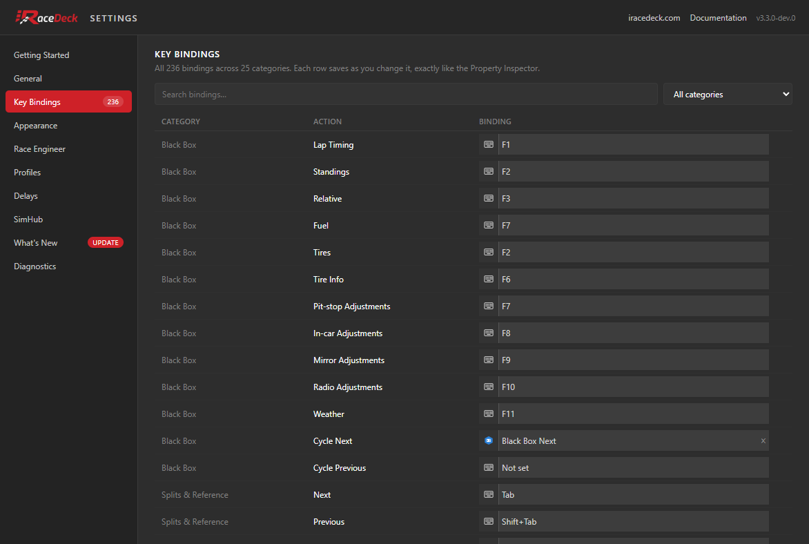
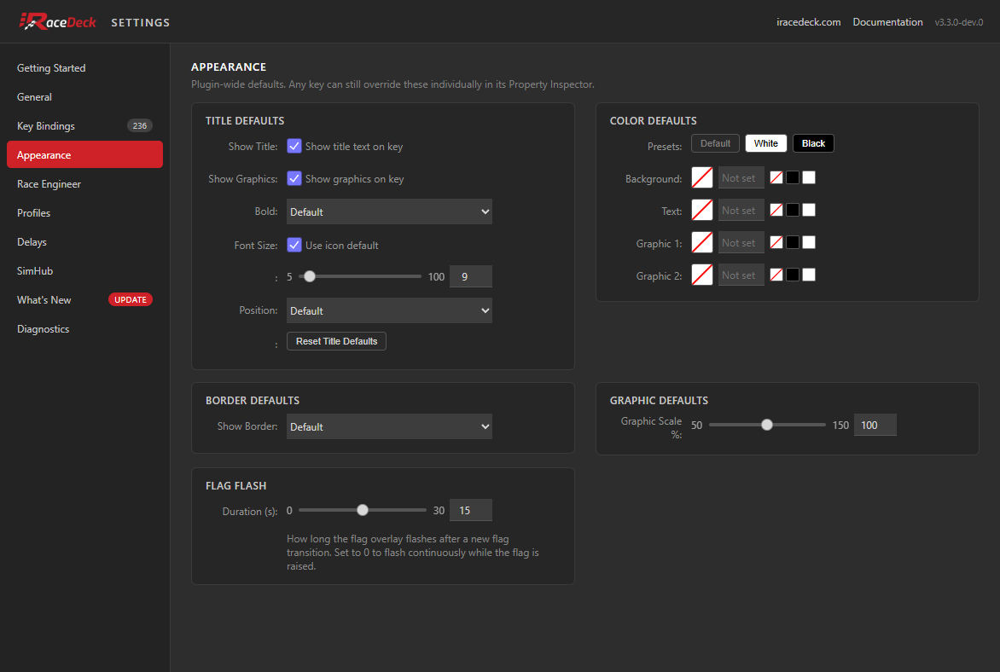
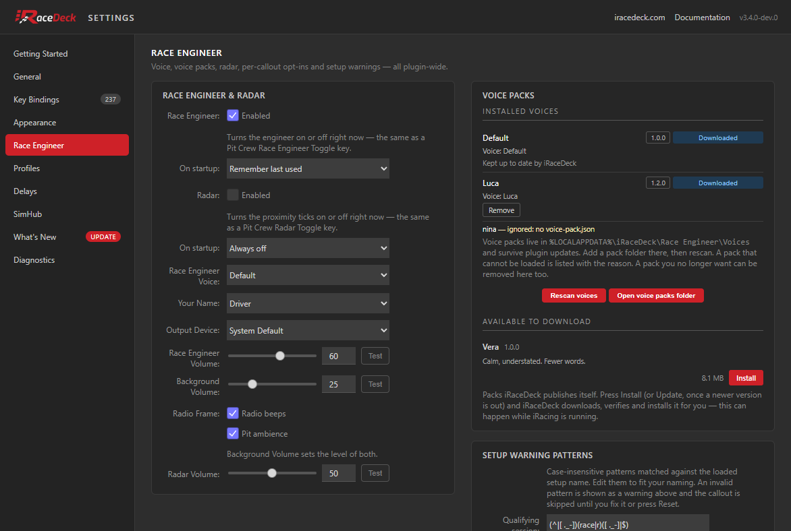
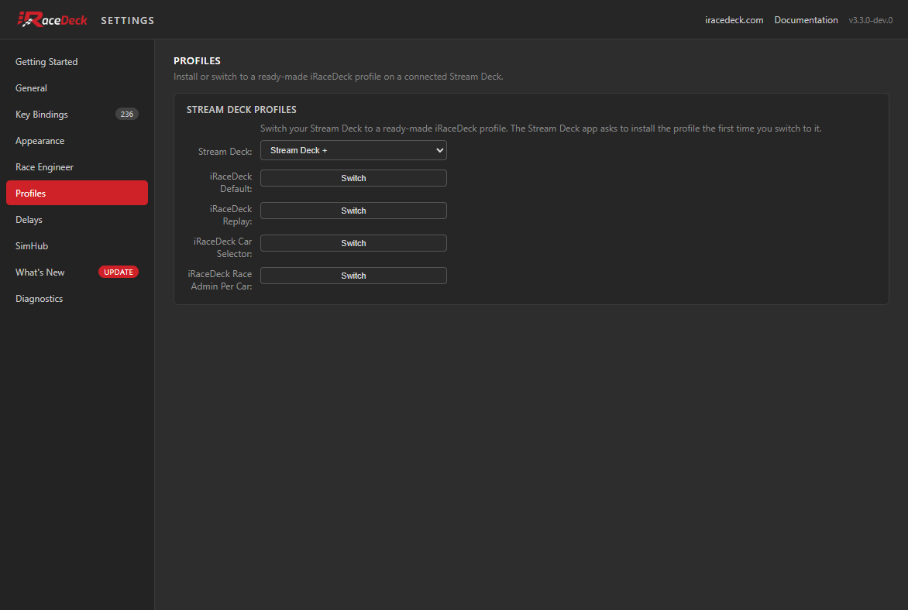
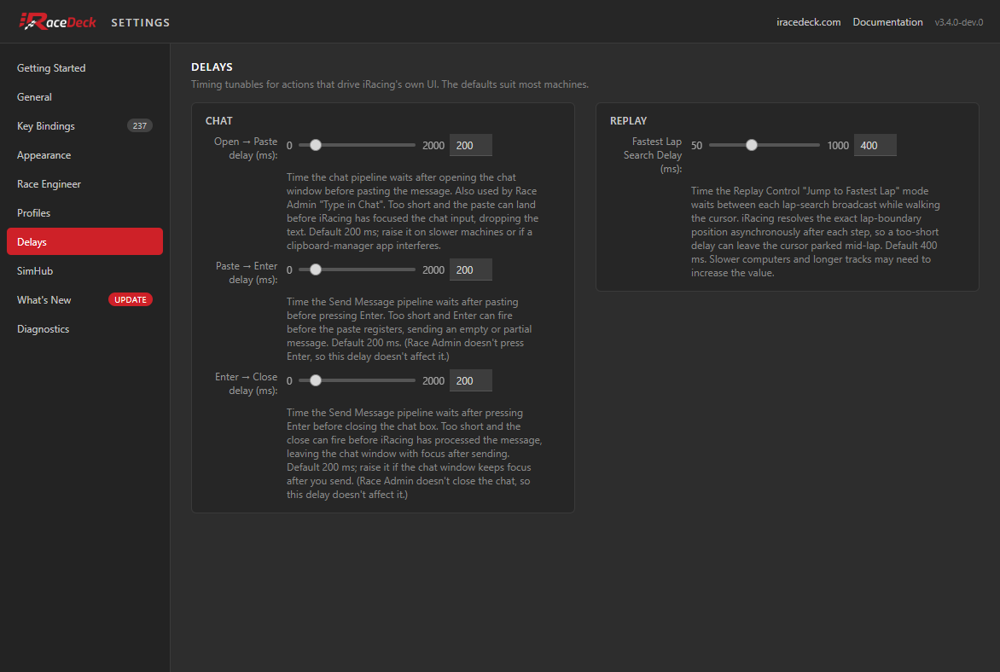
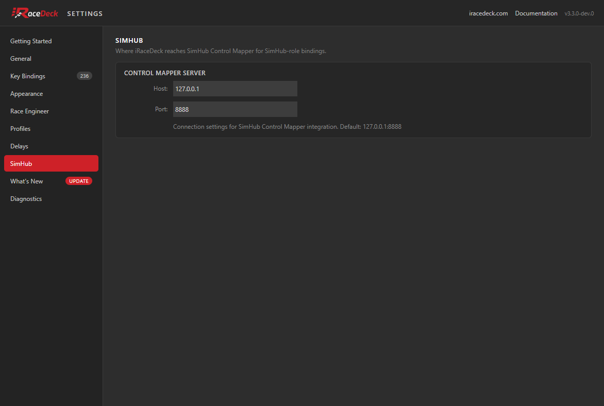
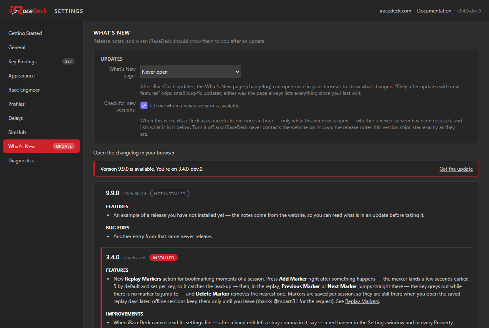
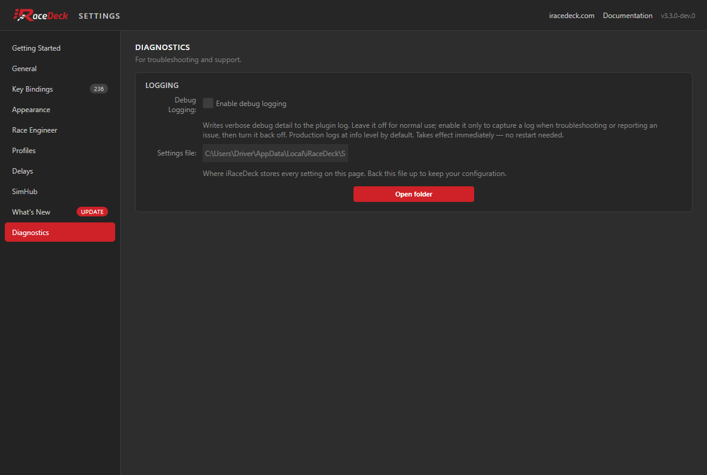

Every iRaceDeck key has its own settings in the deck software's Property Inspector, but many settings apply to the **whole plugin**: your key bindings, the appearance defaults every key inherits, the Race Engineer's voice and callouts, timing tunables, SimHub, and so on. Those used to live inside each Property Inspector — repeated in every one, stacked in a narrow panel. The **Settings window** is their home now.

## Opening It

Select any iRaceDeck key. Directly under that key's own settings — above **Title Overrides**, so you rarely have to scroll for it — is a small button with a cog: **iRaceDeck Settings**. Click it and the window opens on top of the deck software.

That spot is also the dividing line in the panel: everything below the button is about *that one key* (its title, colours, border, graphic scale, and the key bindings it uses), and everything behind the button applies to *every* key.

On a Stream Deck+ dial the button is in the same place, under the dial's own settings.

It is a real window — its own entry in the taskbar, resizable, and it remembers its size and position for next time. It closes itself when the deck software shuts down or restarts.

## The Tabs

The sidebar has one tab per area. Everything here applies to the **whole plugin**; the appearance defaults are the only ones an individual key can override in its own Property Inspector.

### General

Behaviour that affects every key you press.

**Focus iRacing window before sending keys** brings iRacing to the foreground before iRaceDeck sends any input, so a press isn't lost to whatever window happened to have focus. Leave it on unless you specifically don't want iRaceDeck changing which window is active. It only matters for actions that send keystrokes — actions that talk to iRacing over its own API arrive regardless of focus.

**Disable buttons when iRacing is not connected** greys out your keys and ignores presses while iRacing isn't running, so a stray press can't fire keystrokes into whatever else is in the foreground.

**Mouse to Sim** decides where the [Mouse to Sim](/docs/actions/view-camera/view-adjustment/#mouse-to-sim) key parks your pointer inside the iRacing window. Pick a **Horizontal** and a **Vertical** anchor — a corner, an edge or the centre — then nudge the pointer away from it with the two **offset** sliders, which are percentages of the window (positive moves right and down), so your target holds its place at any resolution. The default, Center with Top plus 12.5%, lands on iRacing's own on-screen UI band, which is where the key has always put the pointer.

**Dual-press** governs the setup keys that do one thing on a tap and the opposite on a hold. The **long-press threshold** is how long you must hold before it counts as a hold — shorter feels snappier, longer is more forgiving if you catch keys accidentally. **Directions** picks which way a tap goes; the hold always fires the opposite.

### Key Bindings

Every binding in the plugin, in one searchable table — search by action or category, or filter to a single category with the dropdown. Each row saves the moment you change it, exactly as it would in a Property Inspector.

Each row takes either a **keyboard** shortcut or a **SimHub** Control Mapper role; the small icon at the left of a row switches between the two. A binding set here is the same setting the action's own panel shows, so there is never a need to set it twice.

The same bindings also appear in each key's Property Inspector, filtered to just that action — see [What Stays in the Property Inspector](#what-stays-in-the-property-inspector).

### Appearance

The look every key inherits. Anything set here is a **default**: a key that has its own override in its Property Inspector keeps it.

- **Title defaults** — whether keys show their title text and graphics at all, plus bold, font size and vertical position. *Default* means "leave it to the icon", which is usually what you want; icons whose title is part of the artwork ignore these deliberately.
- **Colour defaults** — background, text and the two graphic slots, with **Default / White / Black** presets as a quick way to recolour the whole plugin. Some icons lock individual slots so their semantic colours (a green arrow, a red indicator) survive a preset.
- **Border defaults** and **Graphic scale** — the border drawn around keys, and how large the artwork is drawn inside them (50–150%).
- **Flag flash** — how long the flag overlay flashes after a new flag. Set it to `0` to keep flashing for as long as the flag is out.

### Race Engineer

Everything about the Race Engineer and the radar: the live on/off toggles and their startup policies, the voice, your name, the output device and the three volumes with **Test** buttons beside them, the setup-warning patterns, and the per-callout opt-ins.

**Race Engineer Voice** and **Your Name** choose who talks to you and what they call you. **Output Device** sends the engineer to a specific device — useful if you want him in your headset while the sim runs on speakers. The three volumes are independent: **Race Engineer** is the voice, **Background** the pit ambience behind it, **Radar** the proximity ticks.

**Callouts** is the long list at the bottom: one checkbox per thing the engineer can tell you, grouped by family — flags, incidents, fuel, spotter and the rest. Turning one off silences that call without touching any other, and takes effect immediately; it never cuts off a callout already playing.

#### Race Engineer and Radar: Now Versus On Startup

The Race Engineer and the radar each have two separate controls, because they answer two different questions.

**Enabled** is live. Ticking it turns the feature on or off there and then — the same thing a Pit Crew [**Race Engineer Toggle** or **Radar Toggle**](/docs/actions/audio-voice/pit-crew/) key does, including the spoken "resuming" / "going silent" acknowledgment. Press the key and the checkbox follows; tick the checkbox and the key's icon follows.

**On startup** decides what the feature comes up as the next time the plugin starts, and never touches the session you are in:

- **Remember last used** — it comes back however you left it.
- **Always on** — every session starts with it on, whatever you did last time.
- **Always off** — every session starts with it off.

So you can run with the engineer on for the rest of tonight and still have it start silent tomorrow, without the two settings fighting each other.

If you upgraded from an earlier version, your old **On startup** checkbox carries over as **Always on** or **Always off**, so nothing changes until you pick something else.

### Profiles

**Stream Deck only.** Mirabox and Ulanzi Deck have no profile system, so this tab is not shown there.

Switch a connected Stream Deck to one of the ready-made iRaceDeck layouts. Because the window is not tied to a particular deck the way a Property Inspector is, it asks which one to switch — with a single deck connected it is already picked for you.

The Stream Deck app asks to install a profile the first time you switch to it. Every bundled profile is listed, whichever deck you pick: each one ships as a variant per supported device, and iRaceDeck resolves the variant that fits the deck you selected when you press **Switch**.

### Delays

Timing for the actions that drive iRacing's own interface rather than talking to it directly. **The defaults suit most machines** — come here only if something misbehaves.

The three **Chat** delays space out the steps of sending a chat message: opening the box, pasting, pressing Enter, closing. Two symptoms worth recognising: text arriving empty or half-typed usually means the paste-to-Enter delay is too short, and the chat box keeping focus after you send means the Enter-to-close delay is. Raise them on a slower machine, or if a clipboard manager gets in the way.

**Fastest Lap Search Delay** is how long Replay Control's *Jump to Fastest Lap* waits between steps while it walks the cursor. iRacing resolves each lap boundary after the fact, so too short a delay leaves the cursor parked mid-lap. Longer tracks and slower machines may need more than the default.

### SimHub

Where iRaceDeck reaches [SimHub](https://www.simhubdash.com/) Control Mapper, for bindings you have set to a SimHub role rather than a keyboard shortcut. The default `127.0.0.1:8888` is right when SimHub runs on the same PC; point it elsewhere if SimHub lives on another machine.

This only matters if you actually use SimHub roles — a purely keyboard-bound setup can ignore this tab entirely. For what a SimHub role is and how to set one up, see [Binding modes: keyboard vs SimHub](/docs/features/key-bindings/#binding-modes-keyboard-vs-simhub).

### What's New

The **Updates** card holds two settings, one for each side of an update. **What's New page** controls when the changelog opens by itself once iRaceDeck has updated:

- **Every update** — after any new version.
- **Only after updates with new features** — the default; small bug-fix releases pass silently.
- **At most once a month** — a quieter option if updates land often.
- **Never** — it never opens on its own.

Whichever you pick, the page always lists everything since your last visit, so a quieter setting never means missing anything — see [the What's New page](/docs/features/whats-new-page/).

**Check for new versions** lets iRaceDeck ask this website, while the Settings window is open, whether a newer version has been released. When it finds one you get an **UPDATE** badge on the tab, a banner naming the new version and a link to the [downloads page](/downloads/), and the newer releases listed above yours marked **Not installed** — so you can read what is in an update before you take it. It asks at most once an hour, only while the window is open, and never at any other time. Turn it off and iRaceDeck never contacts this website on its own; everything below still works exactly as it does now.

Below the settings are the **release notes for every version of iRaceDeck**, newest first. The ones up to and including your version ship inside the plugin rather than being fetched, which means three things:

- They work **offline**, and behind a firewall. If the update check cannot reach the website — no internet, a firewall, or the option switched off — this list is all you see, and nothing about the tab breaks.
- The version you are running is marked **Installed**, so what you have is unambiguous. The window header shows that version too.
- Nothing is described as installed that you do not have. (A test build whose notes are not published yet says so above the list.)

**Open the changelog in your browser** opens the [full changelog](/changelog/) on this website.

### Diagnostics

**Enable debug logging** writes verbose detail to the plugin log. Leave it off for normal use — it takes effect immediately, with no restart, so switch it on only to capture a log when reporting a problem, then switch it back off.

**Settings file** shows exactly where your configuration lives, with an **Open folder** button that reveals it in Explorer. Copying that one file backs up everything on this page — see [Where Your Settings Are Stored](#where-your-settings-are-stored).

## What Stays in the Property Inspector

A key's Property Inspector is now about that key. It has its own settings at the top, then the **iRaceDeck Settings** button, then its per-key overrides — title, colours, border, graphic scale, flags overlay — and one section at the bottom:

- **iRaceDeck Settings** — the small cog button directly under the action's own settings: the way through to everything on this page.
- **Key Bindings** — at the bottom: the bindings that particular action uses, and nothing else. They are plugin-wide settings, but they are the ones you actually want in front of you while setting a key up, so they stay. The same bindings appear in full on the window's Key Bindings tab.

Actions that use no key bindings at all say so instead of showing an empty section.

Bindings edited in either place are the same settings: change one and the other updates live. Both surfaces read and write the same file — see [Where Your Settings Are Stored](#where-your-settings-are-stored).

## If the Window Doesn't Open

Clicking **iRaceDeck Settings** should always produce a window. If it doesn't, iRaceDeck tells you why: a banner appears in every iRaceDeck Property Inspector describing what failed. There are two, they mean different things, and each shows up where it belongs.

**"iRaceDeck could not start its settings service."** The more likely of the two, shown as a red error banner at the top of the panel — because this one is not just about the button. The window is a page iRaceDeck serves to itself on your own PC, so it needs a local connection — and something on this machine stopped it opening. A firewall or security suite blocking local connections is the usual cause; another program already occupying the port is the other.

This one has a consequence worth knowing about, which is why the banner spells it out: **while it lasts, settings changed in a Property Inspector do not take effect either** — key bindings included. That same local connection is how a Property Inspector reaches the plugin. Without it a panel still opens and still shows your settings, and a change you make there still looks saved, but it never arrives. Take the banner as "iRaceDeck is not accepting settings changes right now" rather than only "the window won't open". What you configured earlier is untouched and your keys keep working normally.

The **iRaceDeck Settings** button is marked as unusable at the same time, with a short note directly above it — _"The Settings window cannot open while iRaceDeck's settings service is not running. See the error at the top of this panel."_ — so you can see the button will not work before pressing it.

**"iRaceDeck could not open the Settings window."** Shown as a yellow warning directly above the button you just pressed, and much less serious. The service is running fine — what failed is iRaceDeck handing the page over to a browser: the chromeless app window in Edge or Chrome would not start, _and_ passing the address to your default browser was refused as well. Everything else is unaffected, Property Inspectors included, so settings you change there apply as usual.

This one is rare, and it is worth knowing what it does not cover. iRaceDeck can tell that a browser refused to take the address; it cannot tell what happened afterwards, because nothing reports back once the address has been handed over. So a browser that accepts the request and then shows nothing produces no banner at all. If the button appears to do nothing and neither banner is showing, check whether a browser window opened behind another one, and see [How It Works](#how-it-works) for what iRaceDeck tries.

To clear either one:

1. **Restart your deck software.** Both conditions are re-checked on every start and on every click of the button, so a banner whose cause has gone disappears on its own — it is a live status, not a dismissible message.
2. **Check your firewall or security software** for a rule blocking iRaceDeck, if it is the first banner.

### Banners only ever describe the session you are in

This is true of every iRaceDeck banner, not just these two. Warnings are not remembered between runs: iRaceDeck starts each session with none, and each one you see was raised by the copy of iRaceDeck that is running right now, about conditions it has checked itself. Nothing is ever restored from your settings file, and there is nothing stale to clear out by hand.

That makes a banner that comes back after a restart worth taking at face value — the cause really is still there — and it is why there is no dismiss button: dismissing a live status would only hide something that is still true. It also means a warning can be *missing* while its condition has not been ruled out yet. The Administrator-mismatch warning is the one to know about: iRaceDeck can only compare itself against a running iRacing, so after a restart that banner stays away until iRacing is up again, then reappears as soon as iRaceDeck connects to it if the mismatch is still there.

Whichever of the two failures you hit, its banner also names the full path to your settings file. It is plain text, so you can back it up by copying it, or edit it by hand as a last resort — but **close your deck software first**: while iRaceDeck is running it holds its own copy of your settings and will overwrite hand edits when it next saves.

## Where Your Settings Are Stored

iRaceDeck keeps every setting on this page — and the key bindings shown in each key's Property Inspector — in a file of its own, in your user profile, rather than in the deck software's storage:

| Deck software | Settings file                                                        |
| ------------- | -------------------------------------------------------------------- |
| Stream Deck   | `%LOCALAPPDATA%\iRaceDeck\Settings\Stream Deck\global-settings.json` |
| Mirabox       | `%LOCALAPPDATA%\iRaceDeck\Settings\Mirabox\global-settings.json`     |
| Ulanzi Deck   | `%LOCALAPPDATA%\iRaceDeck\Settings\Ulanzi\global-settings.json`      |

The **Diagnostics** tab shows the exact path for your installation and has an **Open folder** button that reveals the file in Explorer.

The first time you start a version that stores settings this way, iRaceDeck copies your existing settings over from the deck software automatically — there is nothing to do. From then on your settings live with you rather than inside the deck software's own storage, so they survive plugin updates and reinstalls. The window and the Property Inspectors share that one file, which is why a binding changed in either shows up in the other straight away. The deck software keeps a copy too: iRaceDeck refreshes it once every time the plugin starts, so nothing is taken away from it and an older iRaceDeck version installed later still finds your settings where it expects them. That refresh holds off while iRaceDeck is still waiting for the deck software to answer its first read of your existing settings, so a copy it has not read is left alone in the meantime. If the answer never comes at all, iRaceDeck settles after a few startups for the settings it already has, and the refresh goes ahead from then on.

To back up your configuration, copy that one file somewhere safe; to restore it, put it back and restart the deck software. Each deck ecosystem gets its own folder, so a Stream Deck and an Ulanzi Deck installation on the same PC never share settings.

## How It Works

The plugin serves the window itself, on your own machine only (`127.0.0.1`), and opens it as a **chromeless app window** in Microsoft Edge or Google Chrome — whichever is installed — so it looks and behaves like a program window rather than a browser tab. If neither browser is found, it opens in your default browser as a normal tab instead; everything works the same, it just has a tab bar.

The window runs in its own private browser profile, separate from your everyday browsing, so nothing about it — cookies, extensions, sign-ins — is shared with your normal browser.

## Security

Because the window is a local web page, the plugin only answers requests carrying a secret it issued itself: it generates a fresh token when it starts serving (once per plugin run) and hands it to the window it opens and to iRaceDeck's own Property Inspectors so they can reach the plugin. Anything without it is refused, and nothing is reachable from outside your PC. Every setting written from the window goes through the plugin, the same way it would if a Property Inspector had written it — so the window can never store anything the plugin itself wouldn't.
