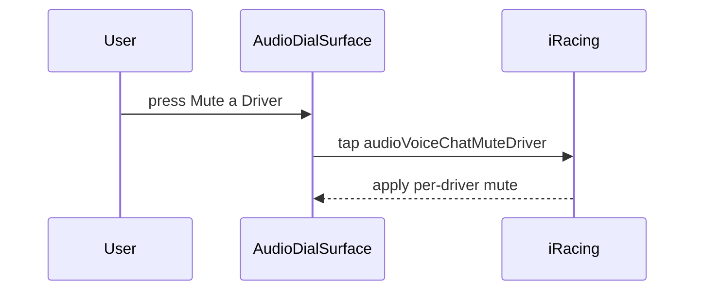

<!-- This is an auto-generated comment: summarize by coderabbit.ai -->
<!-- review_stack_entry_start -->

**Understand this PR’s impact**

Explore downstream dependencies and potential security impact with Blast Radius.

[View blast radius →](<https://app.coderabbit.ai/change-stack/niklam/iracedeck/pull/1195?view=blast-radius>)

<!-- review_stack_entry_end -->
<!-- recent_review_start -->

No actionable comments were generated in the recent review. 🎉

ℹ️ Recent review info

⚙️ Run configuration

**Configuration used**: Organization UI

**Review profile**: CHILL

**Plan**: Essentials

**Run ID**: `77c8c960-3294-47ba-bd46-c71986b16a4f`

📥 Commits

Reviewing files that changed from the base of the PR and between 28bc2d3686f50e9c43adf0636f2840006d82d513 and 9387f2f90c648798753f1f9f754306ea92f52802.

📒 Files selected for processing (1)

* `packages/website/src/content/docs/docs/reference/keyboard-shortcuts.md`

**Included review availability:** 2 reviews are currently available. Your included PR review attempts over the past 7 days set your current allowance at 5 reviews per hour.

---

<!-- recent_review_end -->
<!-- walkthrough_start -->

📝 Walkthrough

## Walkthrough

Audio Controls adds a Voice Chat-only `mute-driver` action for keypad and dial controls. The action uses iRacing’s per-driver binding, updates conditional options, handles unsupported categories, adds tests, and documents the default shortcut.

### Changes

**Voice Chat driver mute**

|Layer / File(s)|Summary|
|---|---|
|**Binding and action contracts**   `packages/iracing-actions/src/actions/audio-controls/audio-controls-settings.ts`, `packages/iracing-actions/src/actions/comms-catalog.ts`, `packages/iracing-actions/src/actions/data/*`, `packages/iracing-actions/src/actions/audio-controls/audio-controls-settings.test.ts`|Added the `mute-driver` action, the `audioVoiceChatMuteDriver` binding, Voice Chat-only binding maps, and unsupported-category fallbacks.|
|**Conditional keypad and dial options**   `packages/iracing-actions/src/actions/audio-controls/audio-controls.ejs`|Added Mute a Driver selectors and generalized category-dependent option handling. Invalid selections reset to safe fallback actions.|
|**Icon rendering and press dispatch**   `packages/iracing-actions/src/actions/audio-controls/audio-controls.ts`, `packages/iracing-actions/src/actions/audio-controls/audio-dial-surface.ts`, `packages/iracing-actions/src/actions/audio-controls/*.test.ts`|Added the driver-mute icon, labels, dial press handling, warning behavior, and no-op behavior for unsupported or missing bindings.|
|**Release and user-facing documentation**   `.claude/skills/iracedeck-actions/SKILL.md`, `packages/iracing-plugin-stream-deck/.../manifest.json`, `packages/website/src/content/docs/*`, `.claude/rules/settings-window.md`|Documented the Voice Chat action, its default shortcut, dial behavior, release entry, and updated key-binding verification count.|

<!-- change_assessment_start -->
**Priority:** ➖ Normal

**Estimated code review effort:** 3 (Moderate) | ~25 minutes

<!-- change_assessment_commit:"9387f2f90c648798753f1f9f754306ea92f52802" -->
**Change:** Feature
<!-- change_assessment_end -->

### Sequence Diagram(s)

<!-- walkthrough_end -->
<!-- pre_merge_checks_walkthrough_start -->

🚥 Pre-merge checks | ✅ 5

✅ Passed checks (5 passed)

|         Check name         | Status   | Explanation                                                                                                                                                                                               |
| :------------------------: | :------- | :-------------------------------------------------------------------------------------------------------------------------------------------------------------------------------------------------------- |
|     Linked Issues check    | ✅ Passed | Issue `#863` requires a new Voice Chat action that mutes the currently speaking driver while leaving other participants audible. The PR adds the `audioVoiceChatMuteDriver` binding with the default `Shif… |
| Out of Scope Changes check | ✅ Passed | The changes remain within issue `#863`. Binding data, action mapping, keypad and dial integration, Voice Chat mode restrictions, stale-action handling, tests, documentation, manifest text, changelog ent… |
|     Docstring Coverage     | ✅ Passed | Docstring coverage is 100.00% which is sufficient. The required threshold is 80.00%. Docstring coverage is scoped to functions touched by this diff. Analyzed 3 functions across 7 files. (1 skipped: 1 … |
|         Title check        | ✅ Passed | The title clearly identifies the primary change: adding the Mute a Driver action to Audio Controls.                                                                                                       |
|      Description check     | ✅ Passed | The description includes all required template sections, links issue `#863`, summarizes the changes, provides test steps and limitations, and completes the checklist.                                      |

<!-- pre_merge_checks_walkthrough_end -->
<!-- finishing_touch_checkbox_start -->

✨ Finishing Touches

🧪 Generate unit tests (beta)

- [ ] <!-- {"checkboxId": "6ba7b810-9dad-11d1-80b4-00c04fd430c8", "radioGroupId": "utg-output-choice-group-unknown_comment_id"} --> Commit to this branch
- [ ] <!-- {"checkboxId": "f47ac10b-58cc-4372-a567-0e02b2c3d479", "radioGroupId": "utg-output-choice-group-unknown_comment_id"} --> Create a new PR

<!-- finishing_touch_checkbox_end -->
<!-- tips_start -->

---

<!-- poem_footer_start -->
A rabbit taps the driver-mute key   Voice Chat keeps the channel free   Dials and keypads now agree   Unsupported modes stay quiet as can be   Bindings guide the action carefully
<!-- poem_footer_end -->

Comment `@coderabbitai help` to get the list of available commands.

<!-- tips_end -->