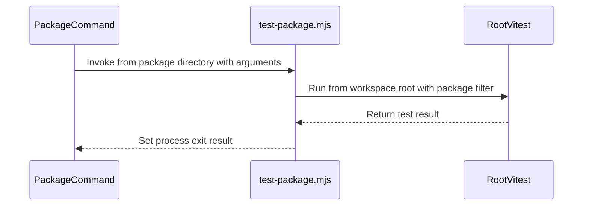

<!-- This is an auto-generated comment: summarize by coderabbit.ai -->
<!-- review_stack_entry_start -->

Navigate logical layers of code changes, visualize relationships, and explore their blast radius.

<!-- review_stack_entry_end -->
<!-- recent_review_start -->

No actionable comments were generated in the recent review. 🎉

ℹ️ Recent review info

⚙️ Run configuration

- **Configuration used**: Organization UI
- **Review profile**: CHILL
- **Plan**: Essentials
- **Run ID**: `0e3e91e0-33b0-4392-9f4f-d5e645603912`

📥 Commits

Reviewing files that changed from the base of the PR and between 4fd934c833edee796acadd4963616d7b7831e1f1 and 3ae30d2844f4c4bd749de5e30521491add4b04fd.

📒 Files selected for processing (2)

* `scripts/claude-hooks/rules-bash.mjs`
* `scripts/claude-hooks/rules-bash.test.mjs`

**Included review availability:** This review used your included allowance. 0 included reviews remain after this review. Your included PR review attempts over the past 7 days set your current allowance at 3 reviews per hour. Your free on-demand review promotion remains active until October 9, 2026 at 6:00 PM UTC.

---

<!-- recent_review_end -->
<!-- walkthrough_start -->

📝 Walkthrough

## Walkthrough

Adds a shared runner for package-scoped Vitest commands. Package scripts and hook checks use the runner, and repository guidance documents package- and path-filtered test commands.

### Changes

**Package Test Execution**

|Layer / File(s)|Summary|
|:---|:---|
|**Shared package test runner**   `scripts/test-package.mjs`, `scripts/test-package.test.mjs`|The runner accepts a package directory, applies a package filter to the root Vitest run, forwards arguments, and returns the test process result. Tests cover argument handling, path validation, CLI resolution, and subprocess execution.|
|**Package scripts and consistency checks**   `packages/*/package.json`, `scripts/package-test-scripts.test.mjs`|Packages with collected tests use the shared runner for `test` and `test:watch`. Packages without collected tests have neither script. A repository test checks those script requirements.|
|**Hook validation**   `scripts/claude-hooks/pre-bash.mjs`, `scripts/claude-hooks/pre-bash.test.mjs`, `scripts/claude-hooks/rules-bash.mjs`, `scripts/claude-hooks/rules-bash.test.mjs`, `.claude/rules/hooks.md`|The hook checks manifests from the command checkout and validates filtered test commands against declared package scripts. Direct Vitest commands remain refused.|
|**Test command guidance**   `.claude/rules/testing.md`, `README.md`, `docs/plans/2026-04-19-audio-architecture-design.md`, `packages/iracing-actions/CLAUDE.md`, `packages/website/src/content/docs/docs/development/*`, `scripts/CLAUDE.md`|Documentation adds package- and path-filtered test examples, describes the root Vitest suite and package runner, and updates test commands in package and plan guidance.|

<!-- change_assessment_start -->
**Priority:** ➖ Normal

**Estimated code review effort:** 3 (Moderate) | ~25 minutes

<!-- change_assessment_commit:"3ae30d2844f4c4bd749de5e30521491add4b04fd" -->
**Change:** Bug fix · **Severity of issue fixed:** Medium
<!-- change_assessment_end -->

### Sequence Diagram(s)

<!-- walkthrough_end -->
<!-- final_review_risk_start -->
**Merge Risk:** _⚪ Minimal_ · up to `3ae30`
<!-- final_review_risk_coverage:{"sourceCommitId":"3ae30d2844f4c4bd749de5e30521491add4b04fd","coveredCommitId":"3ae30d2844f4c4bd749de5e30521491add4b04fd","kind":"reviewed"} -->

This developer-tooling change checks filtered commands throughout a command chain, with coverage for a later invalid package. No concrete merge-blocking issue is apparent.
<!-- final_review_risk_end -->
<!-- pre_merge_checks_walkthrough_start -->

🚥 Pre-merge checks | ✅ 5

✅ Passed checks (5 passed)

|         Check name         | Status   | Explanation                                                                                                                                                                                               |
| :------------------------: | :------- | :-------------------------------------------------------------------------------------------------------------------------------------------------------------------------------------------------------- |
|         Title check        | ✅ Passed | The title clearly summarizes the main change: running package tests through one shared runner.                                                                                                            |
|      Description check     | ✅ Passed | The description includes the required sections, explains the changes and test steps, and completes the checklist. It also records the earlier test failure and subsequent green runs.                     |
|     Linked Issues check    | ✅ Passed | Issue `#1021` requires each documented per-package test command to run that package’s tests or fail loudly. The shared runner and package scripts implement package-filtered root Vitest runs. Packages wi… |
| Out of Scope Changes check | ✅ Passed | The runner, package manifests, guards, hook behavior, regression tests, and documentation updates support issue `#1021`. The hook’s checkout-aware manifest lookup supports accurate script checks for the… |
|     Docstring Coverage     | ✅ Passed | Docstring coverage is 83.33% which is sufficient. The required threshold is 80.00%. Docstring coverage is scoped to functions touched by this diff. Analyzed 6 functions across 7 files.                  |

<!-- pre_merge_checks_walkthrough_end -->
<!-- finishing_touch_checkbox_start -->

✨ Finishing Touches

📝 Generate docstrings

- [ ] <!-- {"checkboxId":"3e1879ae-f29b-4d0d-8e06-d12b7ba33d98"} --> Commit to this branch
- [ ] <!-- {"checkboxId":"7962f53c-55bc-4827-bfbf-6a18da830691"} --> Create a new PR

🧪 Generate unit tests (beta)

- [ ] <!-- {"checkboxId": "6ba7b810-9dad-11d1-80b4-00c04fd430c8", "radioGroupId": "utg-output-choice-group-unknown_comment_id"} --> Commit to this branch
- [ ] <!-- {"checkboxId": "f47ac10b-58cc-4372-a567-0e02b2c3d479", "radioGroupId": "utg-output-choice-group-unknown_comment_id"} --> Create a new PR

<!-- finishing_touch_checkbox_end -->

<!-- autopilot:start -->
- [ ] <!-- {"checkboxId":"2708ad07-9f24-4260-9c11-7dc76a49f2e3"} --> <strong title="Keep fixing CodeRabbit findings and required CI, and resolving merge conflicts">Autopilot</strong> · Keep fixing CodeRabbit findings and required CI, and resolving merge conflicts
<!-- autopilot:end -->
<!-- tips_start -->

---

<!-- poem_footer_start -->
A rabbit runs tests from a package today, Root Vitest finds files along the way. Watch mode hops when the flag is in sight, Arguments travel and results come right. The hook checks the checkout before granting the run, Then I nibble a carrot—the tests are done!
<!-- poem_footer_end -->

Comment `@coderabbitai help` to get the list of available commands.

<!-- tips_end -->