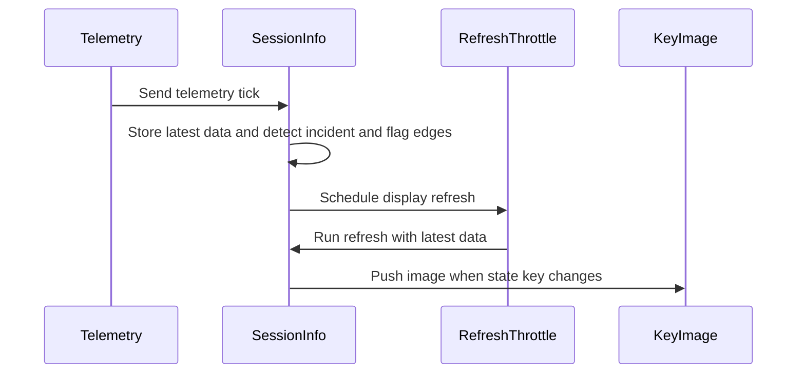

<!-- This is an auto-generated comment: summarize by coderabbit.ai -->
<!-- review_stack_entry_start -->

<a href="https://app.coderabbit.ai/change-stack/niklam/iracedeck/pull/1382?scope=REDACTED&amp;cs_source=review_comment"><picture><source media="(prefers-color-scheme: dark)" srcset="https://storage.googleapis.com/coderabbit_public_assets/review-stack-in-coderabbit-ui-dark.svg?v=3"><source media="(prefers-color-scheme: light)" srcset="https://storage.googleapis.com/coderabbit_public_assets/review-stack-in-coderabbit-ui.svg?v=3"></picture></a>

<!-- review_stack_entry_end -->
<!-- recent_review_start -->

No actionable comments were generated in the recent review. 🎉

<strong>ℹ️ Recent review info</strong>

<dl>
<dd>

<strong>⚙️ Run configuration</strong>

<dl>
<dd>

- **Configuration used**: Organization UI
- **Review profile**: CHILL
- **Plan**: Essentials
- **Run ID**: `a59a5f2f-036d-4ba4-bc34-56b1bc77badf`

</dd>
</dl>

<strong>📥 Commits</strong>

<dl>
<dd>

Reviewing files that changed from the base of the PR and between 19dc18c8e62b6587ec9f13ba0af1c91b1e77d1c2 and f84e952c9462f314713f9e4dcedbb18362c8fbc8.

</dd>
</dl>

<strong>📒 Files selected for processing (4)</strong>

<dl>
<dd>

* `packages/iracing-actions/src/actions/data/changelog.json`
* `packages/iracing-actions/src/actions/session-info/session-info.test.ts`
* `packages/iracing-actions/src/actions/session-info/session-info.ts`
* `packages/website/src/content/docs/changelog.mdx`

</dd>
</dl>

**Included review availability:** This review used your included allowance. 1 included review remains after this review. Your included PR review attempts over the past 7 days set your current allowance at 3 reviews per hour.

</dd>
</dl>

---

<!-- recent_review_end -->
<!-- walkthrough_start -->

<strong>📝 Walkthrough</strong>

<dl>
<dd>

## Walkthrough

Session Info now resolves display values and renders images during a throttled refresh instead of on every telemetry tick. Incident and flag edges remain checked on each tick. The release changelogs describe the change.

### Changes

**Session Info refresh flow**

|Layer / File(s)|Summary|
|:---|:---|
|**Per-tick edge detection**   `packages/iracing-actions/src/actions/session-info/session-info.ts`, `packages/iracing-actions/src/actions/session-info/session-info.test.ts`|The telemetry subscription stores the newest telemetry and checks incident and flag edges on each tick. Flash handling errors are caught and logged.|
|**Throttled value resolution and rendering**   `packages/iracing-actions/src/actions/session-info/session-info.ts`, `packages/iracing-actions/src/actions/session-info/session-info.test.ts`, `packages/iracing-actions/src/actions/data/changelog.json`, `packages/website/src/content/docs/changelog.mdx`|The refresh uses current settings and the latest telemetry. It skips active flag animations, suppresses repeated errors, and pushes an image only when the state key changes. Tests and changelog entries cover these behaviors.|

<!-- change_assessment_start -->
**Priority:** ➖ Normal

**Estimated code review effort:** 3 (Moderate) | ~20 minutes

<!-- change_assessment_commit:"f84e952c9462f314713f9e4dcedbb18362c8fbc8" -->
**Change:** Bug fix · **Severity of issue fixed:** Medium
<!-- change_assessment_end -->

### Sequence Diagram(s)

</dd>
</dl>

<!-- walkthrough_end -->
<!-- final_review_risk_start -->
**Merge Risk:** **⚪ Minimal** · up to `f84e9`
<!-- final_review_risk_coverage:{"sourceCommitId":"f84e952c9462f314713f9e4dcedbb18362c8fbc8","coveredCommitId":"f84e952c9462f314713f9e4dcedbb18362c8fbc8","kind":"reviewed"} -->

Session Info keys now do their value work on throttled refreshes instead of on every telemetry update. Incident and flag flashes still start immediately. No merge-blocking risk was identified.
<!-- final_review_risk_end -->
<!-- pre_merge_checks_walkthrough_start -->

<strong>Pre-merge checks | <picture></picture> 4 | <picture></picture> 1</strong>

<dl>
<dd>

### ❌ Failed checks (1 warning)

|     Check name     |                                              Status                                              | Explanation                                                                                                                                                                                               | Resolution                                                                         |
| :---------------- | :----------------------------------------------------------------------------------------------: | :-------------------------------------------------------------------------------------------------------------------------------------------------------------------------------------------------------- | :--------------------------------------------------------------------------------- |
| Docstring Coverage |  | Docstring coverage is 0.00% which is insufficient. The required threshold is 80.00%. Docstring coverage is scoped to functions touched by this diff. Analyzed 2 functions across 2 files. (2 skipped: 2 … | Write docstrings for the functions missing them to satisfy the coverage threshold. |

<strong>✅ Passed checks (4 passed)</strong>

<dl>
<dd>

|         Check name         |                                             Status                                             | Explanation                                                                                                                                                                                               |
| :------------------------ | :--------------------------------------------------------------------------------------------: | :-------------------------------------------------------------------------------------------------------------------------------------------------------------------------------------------------------- |
|         Title check        |  | The title clearly and concisely describes the primary performance change: resolving Session Info values inside the icon throttle.                                                                         |
|      Description check     |  | The description includes all required sections, explains the implementation and scope, documents testing results, and completes the checklist.                                                            |
|     Linked Issues check    |  | Issue `#1345` requires throttling value resolution and rendering while preserving per-tick incident and flag edge detection. The diff stores the newest telemetry, schedules one refresh closure per key, … |
| Out of Scope Changes check |  | The changes are limited to `session-info.ts`, its tests, and the package and website changelog entries. These files and changes directly implement or document issue `#1345`. The tests and error handling… |

</dd>
</dl>

<strong>Full details: Docstring Coverage</strong>

<dl>
<dd>

**Explanation**

Docstring coverage is 0.00% which is insufficient. The required threshold is 80.00%. Docstring coverage is scoped to functions touched by this diff. Analyzed 2 functions across 2 files. (2 skipped: 2 unsupported.)

</dd>
</dl>

</dd>
</dl>

<!-- pre_merge_checks_walkthrough_end -->

- [ ] <!-- {"checkboxId":"585bb3f6-faf5-4dbf-96d2-74e382adf19a"} --> Fix all pre-merge checks with AI
<!-- finishing_touch_checkbox_start -->

<strong>✨ Finishing Touches 💡 1</strong>

<dl>
<dd>

<!-- finishing_touch_suggestion:docstrings -->

<strong>📝 Generate docstrings 💡</strong>

<dl>
<dd>
<dl>
<dd>

- [ ] <!-- {"checkboxId":"3e1879ae-f29b-4d0d-8e06-d12b7ba33d98"} --> Commit to this branch
- [ ] <!-- {"checkboxId":"7962f53c-55bc-4827-bfbf-6a18da830691"} --> Create a new PR

</dd>
</dl>

</dd>
</dl>

<strong>🧪 Generate unit tests (beta)</strong>

<dl>
<dd>

- [ ] <!-- {"checkboxId": "6ba7b810-9dad-11d1-80b4-00c04fd430c8", "radioGroupId": "utg-output-choice-group-unknown_comment_id"} --> Commit to this branch
- [ ] <!-- {"checkboxId": "f47ac10b-58cc-4372-a567-0e02b2c3d479", "radioGroupId": "utg-output-choice-group-unknown_comment_id"} --> Create a new PR

</dd>
</dl>

</dd>
</dl>

<!-- finishing_touch_checkbox_end -->

<!-- autopilot:start -->
- [ ] <!-- {"checkboxId":"2708ad07-9f24-4260-9c11-7dc76a49f2e3"} --> <strong title="Keep fixing CodeRabbit findings and required CI, and resolving merge conflicts">Autofix</strong> · Keep fixing CodeRabbit findings and required CI, and resolving merge conflicts
<!-- autopilot:end -->
<!-- tips_start -->

---

<!-- poem_footer_start -->
A rabbit watched the gauges glow, While tick by tick the flags would show. Values waited for their measured turn, Then changed keys earned an image’s burn. The rabbit hopped through data clear, And nibbled carrots without fear.
<!-- poem_footer_end -->

Comment `@coderabbitai help` to get the list of available commands.

<!-- tips_end -->